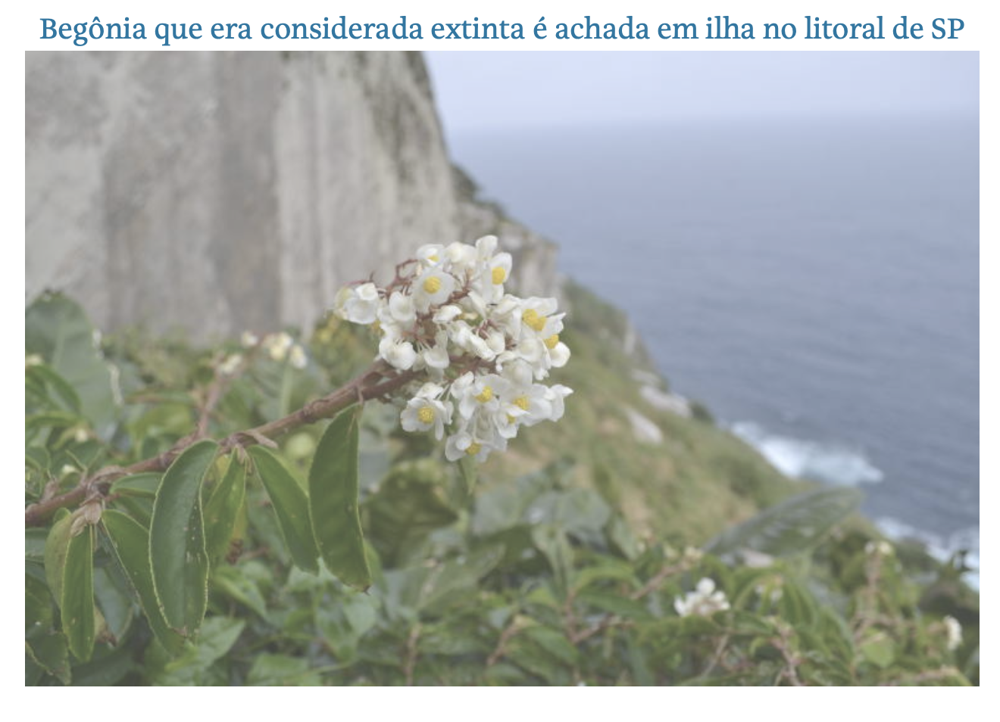

### My research in the press

  <label>
    Filter by year:
    <select id="media-year-filter">
      <option value="all">All years</option>
      <option value="2026">From 2026</option>
    </select>
  </label>
  <label>
    Keyword:
    <input type="text" id="media-keyword-filter" placeholder="Begonia, forest, climate...">
  </label>

::: {.media-list}

::: {.media-item data-year="2026"}

🗞️ Folha de S.Paulo · February 2026

[**Planta considerada extinta volta a ser vista em ilha no litoral de SP após cem anos**](https://www1.folha.uol.com.br/ciencia/2026/02/planta-considerada-extinta-volta-a-ser-vista-em-ilha-no-litoral-de-sp-apos-cem-anos.shtml){.media-title}

Ana Bottallo

Coverage of the rediscovery of *Begonia larorum* on Ilha de Alcatrazes after over 100 years. Based on: Sabino, **Kamimura** et al. (2025), [*Oryx*](https://www.cambridge.org/core/journals/oryx/article/rediscovery-and-conservation-of-begonia-larorum-begoniaceae-a-critically-endangered-insular-narrow-endemic-species-of-brazil/2C1188782B29E0A99746F113DEC4C9C5).

[{.media-thumb}](https://www1.folha.uol.com.br/ciencia/2026/02/planta-considerada-extinta-volta-a-ser-vista-em-ilha-no-litoral-de-sp-apos-cem-anos.shtml)

:::

:::

